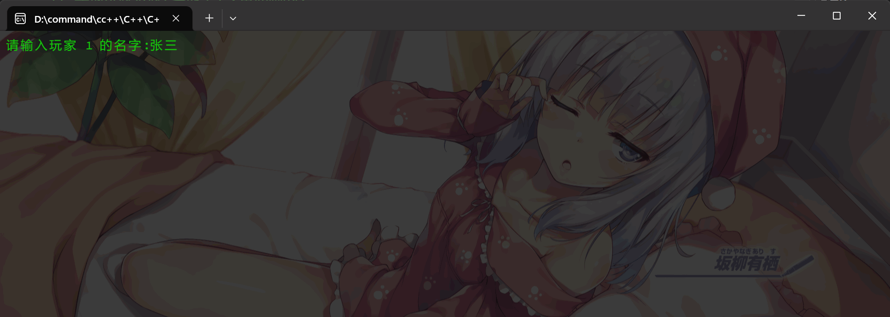

# 题目
## 练习
- 使用函数实现一个计算器(支持加减乘除、平方和取模): 略

- 使用递归实现`斐波那契数列`的计算

```C
// 核心函数
unsigned int fib(unsigned int n) {
    if (n == 0) {
        return 0;
    }
    if (n == 1) {
        return 1;
    }
    return fib(n - 1) + fib(n - 2);
}
```

## 作业
- 实现一个洗牌程序。所谓洗牌程序, 就是将所有的扑克牌放入 **一个** 数组中, 要求把数组内的扑克牌顺序随机打乱, 然后输出 (示例见下)

- [我来助你!]: 
    - 这道题需要你进行一些额外的学习, 比如既然是洗牌, 那就是要求随机打乱一个数组内的所有元素。这个“随机”如何实现呢? 我们可以通过 C 语言`stdlib.h`库的 [srand](https://fishc.com.cn/thread-84362-1-1.html) 函数和 [rand](https://fishc.com.cn/thread-84363-1-1.html) 函数来实现。

    - 那方角、梅花、红桃和黑桃如何表示呢? 你可以使用整数`1~54`来代表扑克的`54`张牌, 比如`1~10`代表`方角1~方角10`, `11~20`代表`梅花1~梅花10`... 那么`41`、`42`、`43`就可以用来表示`方角J`、`方角Q`和`方角K`, 以此类推。

    - 建议: 洗牌、发牌、显示分别用独立的函数来封装, 实现模块化编程。

```C
请输入 1号 玩家的名字: awa
请输入 2号 玩家的名字: qwq
请输入 3号 玩家的名字: 0.0
方 = 方块,  梅 = 梅花,  红 = 红桃,  黑 = 黑桃
玩家 [awa] 手上的是: 方Q 方1  黑3  小王 方4  大王 黑2  黑J 黑4  方6  红J 黑9  梅Q 红9  黑10  红1  梅4  
玩家 [qwq] 手上的是: 梅K 红4  方J 梅2  梅9  梅J 方7  方2  梅10  黑5  黑Q 黑7  梅8  梅3  红Q 梅6  红6
玩家 [0.0] 手上的是: 方5  红5  红7  方9  方K 红3  方10  红K 方3  黑6  红10  红8  方8  梅1  梅7  梅5  红2
是否重新洗牌?(y/n): n
```

## 答案

- 标准答案: (老污龟写的)
```C
#include <stdio.h>
#include <stdlib.h>
#include <time.h>

void shuffle(int array[], int length);
void deal(int array[], int player[3][14]);
void show(char names[3][40], int player[3][14]);

void shuffle(int array[], int length) {
    int index, temp, i;
    srand(time(NULL));
    for (i = 0; i < length; i++) {
        index = rand() % (length - i) + i;
        
        // 取余数的目的是为了保证生成的随机数在指定的范围内，即[i, length-1]。
        // 通过取余数和加上i，可以将生成的随机数映射到数组的下标范围内，从而实现随机交换数组中的元素。
        
        if (index != i) {
            // 交换
            temp = array[i];
            array[i] = array[index];
            array[index] = temp;
        }
    }
}

void deal(int array[], int player[3][14]) { // 更加斗地主一些
    int i, j, k = 0;
    // 模拟发牌：拿起一副无序的扑克每人轮流发一张牌
    for (i = 0; i < 14; i++) {
        for (j = 0; j < 3; j++) {
            player[j][i] = array[k++];
        }
    }
}

void show(char names[3][40], int player[3][14]) {
    int i, j, poker;
    printf("\n方=方角，梅=梅花，红=红桃，黑=黑桃\n\n");
    for (i = 0; i < 3; i++) {
        printf("%s手上的牌是：", names[i]);
        for (j = 0; j < 14; j++) {
            poker = player[i][j];
            if (poker < 11 && 0 < poker) {
                printf("方%d ", poker);
            } else if (poker < 21 && 10 < poker) {
                printf("梅%d ", poker-10);
            } else if (poker < 31 && 20 < poker) {
                printf("红%d ", poker-20);
            } else if (poker < 41 && 30 < poker) {
                printf("黑%d ", poker-30);
            } else {
                switch (poker) {
                    case 41: printf("方J "); break;
                    case 42: printf("方Q "); break;
                    case 43: printf("方K "); break;
                    case 44: printf("梅J "); break;
                    case 45: printf("梅Q "); break;
                    case 46: printf("梅K "); break;
                    case 47: printf("红J "); break;
                    case 48: printf("红Q "); break;
                    case 49: printf("红K "); break;
                    case 50: printf("黑J "); break;
                    case 51: printf("黑Q "); break;
                    case 52: printf("黑K "); break;
                    case 53: printf("小王 "); break;
                    case 54: printf("大王 "); break;
                }
            }
        }
        printf("\n\n");
    }
}

int main(void) {
    int array[54];
    int player[3][14];
    int i, ch;
    char names[3][40];

    // 初始化扑克牌
    // 1~10代表方(角)1～10, 41、42、43代表方(角)J、Q、K 
    // 11~20代表梅(花)1～10, 44、45、46代表梅(花)J、Q、K 
    // 21~30代表红(桃)1～10, 47、48、49代表红(桃)J、Q、K 
    // 31~40代表黑(桃)1～10, 50、51、52代表黑(桃)J、Q、K 
    // 53、54当然就代表小王大王啦～
    for (i = 0; i < 54; i++) {
        array[i] = i + 1;
    }

    for (i = 0; i < 3; i++) {
        printf("\n请输入%d号玩家的名字：", i+1);
        scanf("%s", names[i]);
    }

    do {
        shuffle(array, 54);
        deal(array, player);
        show(names, player);

        printf("重新洗牌(Y/N)？");
        do {
            ch = getchar(); // 过滤输入缓冲区的其他字符
        } while (ch != 'Y' && ch != 'N');
    } while (ch == 'Y');

    return 0;
}
```

- 参考答案2: (23年7月学习C语言时候写的, 可读性一般, 建议结合上面的代码一起看)

```C
#include <stdio.h>
#include <stdlib.h>
#include <time.h>

#define NAME_LEN_MAX 64

// 洗牌函数(玩家1的牌, 玩家2的牌, 玩家3的牌, 地主牌)
void xi_pai(int *n1_p, int *n2_p, int *n3_p, int *dzp);

// 打印牌的函数(玩家1的牌, 玩家2的牌, 玩家3的牌, 玩家1的名字, 玩家2的名字, 玩家3的名字)
void pai_printf(int *n1_p, int *n2_p, int *n3_p, char *n1, char *n2, char *n3);

void xi_pai(int *n1_p, int *n2_p, int *n3_p, int *dzp) {
    // 洗牌: 传入数组, 在函数通过指针进行修改数组.
    // md, 代码要求的图片里面每个人才14张牌, lztm直接写个正规的斗地主.. 先每人17站牌先, 地主牌都给你分好!! (2024-9-24注: 然后我就忘记要写地主牌这回事了qwq...)
    time_t t;
    srand((unsigned)time(&t)); // 使用当前时间值初始化伪随机数种子序列
    int qb[54]; // 暂时存放54张牌
    int j; // 暂时存放伪随机数
    int *p[] = {n1_p, n2_p, n3_p}; // 指针数组

    for (int i = 0; i < 54; i++) { // 开始洗牌
        while (1) {
            j = rand() % 100;// 输出 0 ~ 99 的伪随机数
            if (j < 54) { // 这样子概率应该比 54 以上的 - 50 的概率平衡
                for (int k = 0; k < i; k++) { // 判断该随机数在不在已知中
                    if (qb[k] == j) { // 发现重复
                        goto OUT;
                    }
                }
                qb[i] = j; // 合格
                break;
            } else {
                OUT:
                continue;
            }
        }
    }

    // 传出 玩家牌(分牌于不同数组方便整理什么的)
    for (int i = 0; i < 3; i++) {
        for (int k = (i + 1) * 17 - 1; k >= i * 17; k--) { // k++ 的方法, 哪天写一下试试!(数学问题) 
            *(*(p + i) + k - i * 17) = qb[k]; // 我发现指针真tm nb, 要是写函数怎么能这么短?!
        }
    }

    for (int i = 51, k = 0; i < 54; i++, k++) {
        *(dzp + k) = qb[i];
    }
}

void pai_printf(int *n1_p, int *n2_p, int *n3_p, char *n1, char *n2, char *n3) {
    // 显示牌: 4 * 13 = 52
    // ですから, 0 - 9 方块, 10 - 19 梅花, 20 - 29 红桃, 30 - 39 黑桃,  的 1~10
    // 40-43(J), 44-47(Q), 48-51(K), 52 - 53 大小王; [被JQK背刺了,没有注意到不能直接数字化输出呢!]
    int *p[] = {n1_p, n2_p, n3_p};
    char *name_p[] = {n1, n2, n3};
    int j; // 缓存牌
    printf("方 = 方块,  梅 = 梅花,  红 = 红桃,  黑 = 黑桃\n");

    for (int i = 0; i < 3; i++) {   
        printf("玩家 [%s] 手上的是: ", *(name_p + i));
        for (int k = 0; k < 17; k++) {
            j = *(*(p + i) + k);
            if (j < 10) {
                printf("方%d  ", j + 1);
            } else if (j >= 10 && j < 20) {
                printf("梅%d  ", j - 9);
            } else if (j >= 20 && j < 30) {
                printf("红%d  ", j - 19);
            } else if (j >= 30 && j < 40) {
                printf("黑%d  ", j - 29);
            } else {
                switch (j) {
                    case 40: {
                        printf("方J ");
                        break;
                    }
                    case 41: {
                        printf("梅J ");
                        break;
                    }
                    case 42: {
                        printf("红J ");
                        break;
                    }
                    case 43: {
                        printf("黑J ");
                        break;
                    }
                    case 44: {
                        printf("方Q ");
                        break;
                    }
                    case 45: {
                        printf("梅Q ");
                        break;
                    }
                    case 46: {
                        printf("红Q ");
                        break;
                    }
                    case 47: {
                        printf("黑Q ");
                        break;
                    }
                    case 48: {
                        printf("方K ");
                        break;
                    }
                    case 49: {
                        printf("梅K ");
                        break;
                    }
                    case 50: {
                        printf("红K ");
                        break;
                    }
                    case 51: {
                        printf("黑K ");
                        break;
                    }
                    case 52: {
                        printf("小王 ");
                        break;
                    }
                    case 53: {
                        printf("大王 ");
                        break;
                    }
                }
            }
        }
        printf("\n");
    }
}

int main() {
    // 0. 实现一个洗牌程序。所谓洗牌程序，就是将所有的扑克牌放入一个数组中，要求把数组内的扑克牌顺序随机打乱，然后输出。
    // 这道题需要你进行一些额外的学习，比如既然是洗牌，那就是要求随机打乱一个数组内的所有元素。
    // 这个“随机”如何实现呢？我们可以通过 C 语言 stdlib.h 库的 srand 函数和 rand 函数来实现
    // 那方角、梅花、红桃和黑桃如何表示呢？
    // 你可以使用整数 1~54 来代表扑克的 54 张牌
    // 建议：洗牌、[发牌]、显示分别用独立的函数来封装，实现模块化编程。(发牌我用指针数组更快捏)
    char name_1[NAME_LEN_MAX], name_2[NAME_LEN_MAX], name_3[NAME_LEN_MAX]; // 存放名字
    int name_1p[17], name_2p[17], name_3p[17], di_zu_pai[3]; // 存放牌的编码
    char yes_or_no = '\0';
    // 暂时除支持中文(本机的问题)
    printf("请输入 1号 玩家的名字:");
    scanf("%s", name_1);
    printf("请输入 2号 玩家的名字:");
    scanf("%s", name_2);
    printf("请输入 3号 玩家的名字:");
    scanf("%s", name_3);
    
    while (1) {
        // 觉得要把 \n 处理了
        getchar();
        xi_pai(name_1p, name_2p, name_3p, di_zu_pai); // 洗牌
        pai_printf(name_1p, name_2p, name_3p, name_1, name_2, name_3);
        printf("是否重新洗牌?(y/n):");
        scanf("%c", &yes_or_no);
        if (yes_or_no == 'n') {
            break;
        }
        printf("\n\t---重新洗牌---\n");
    }
    return 0;
}
```

- 评分标准:

|分数|注解|
|:-|:-|
|0分|未提交|
|10分|没有按要求 (比如: 面向printf的编程 (只有printf))|
|30分|提交但运行不正确, (主要在于提交了)|
|50分|运行大致没问题, 但是没有模块化编程(使用函数), 且没有实现洗牌(每一次发牌都是一样的)|
|60分|运行大致没问题, 但是没有模块化编程(使用函数)|
|70分|运行大致没问题, 但是没有实现洗牌(每一次发牌都是一样的)(但是不是单纯的printf, 至少也是遍历数组)|
|90分|运行正确, 但是没有注释|
|100分|运行正确, 有基本的注释, 代码风格统一|

> 注: 如果无法编译等其他原因, 酌情给分

## 拓展

我突然发现之前学C++(23年国庆)的时候写的这个, 有兴趣的可以看看..(实际上用的还是C风格的C++)



(加`_demo`前缀是因为这个是多文件编译的, .cpp会函数重名, 偷懒就这样标识了)

```C++
#include <iostream>
#include <cstdlib>	// 产生随机数
#include <ctime>	// 系统时间

using namespace std;

#define DECK 54				// 一副牌的牌的数量
#define PLAYER_NUM 3		// 玩家数量
#define LICENSING_DELAY 200 // 发牌延迟 (单位 ms)

static struct PlayerData
{
	char name[36] = "未命名用户";	// 玩家名
	char brand[17];					// 牌
	bool tag = 0;					// 0是农民, 1是地主 (现在没什么用)
};

static const char* str[] = { "黑桃", "红桃", "梅花", "方块", "大王", "小王" };

static PlayerData* _demo_12_playerData(int num);
static void _demo_12_playerData_free(PlayerData** res);
static char* _demo_12_xiPai(void);																			// 洗牌
static void _demo_12_xianshiPaiData(char data);																// 显示牌
static void _demo_12_printPai(PlayerData playerMen[PLAYER_NUM], int play_id, int pai_position);				// 显示全部玩家的牌
static void _demo_12_faPai(char* res, PlayerData playerMen[PLAYER_NUM]);									// 发牌
static void _demo_12_xiPai_free(char** res);

static void _demo_12_xianshiPaiData(char data)
{
	char ch;
	if (data <= 51)
	{
		ch = data % 13;
		cout << str[data % 4];
		if (ch < 10 && ch > 0)	// 不包含 A JQK
		{
			cout << char('0' + ch);
		}
		else
		{
			switch (ch)
			{
			case 0:
			{
				cout << 'A';
				break;
			}
			case 10:
			{
				cout << 'J';
				break;
			}
			case 11:
			{
				cout << 'Q';
				break;
			}
			case 12:
			{
				cout << 'K';
				break;
			}
			default:
				break;
			}
		}
	}
	else
	{
		if (data == 52)
		{
			cout << str[4];
		}
		else
		{
			cout << str[5];
		}
	}
}

static PlayerData* _demo_12_playerData(int num)
{
	PlayerData* res = (PlayerData*)malloc(sizeof(PlayerData) * num);
	for (int i = 0; i < num; ++i)
	{
		system("cls");
		cout << "请输入玩家 " << i + 1 << " 的名字:";
		cin >> res[i].name;
	}

	return res;
}

static void _demo_12_playerData_free(PlayerData** res)
{
	free(*res);
	*res = nullptr;
}

static char* _demo_12_xiPai(void)	// 洗牌
{
	// 返回一个 值为 0 - 53 的, 不重复的字符数组
	char* res = (char*)malloc(sizeof(char) * DECK);
	srand(time(NULL));
	for (int i = 0, j, k; i < DECK; ++i)
	{
		while (true)
		{
			j = rand() % DECK;
			for (k = 0; k < i; ++k)
			{
				if (res[k] == j)
					break;
			}

			if (k == i)
			{
				break;
			}
		}
		res[i] = j;
	}

	return res;
}

static void _demo_12_printPai(PlayerData playerMen[PLAYER_NUM], int play_id, int pai_position)				// 显示全部玩家的牌
{
	char ch;
	system("cls");
	for (int i = 0, j, k; i < PLAYER_NUM; ++i)
	{	
		cout << "玩家 [" << playerMen[i].name << "] 的牌:";
		k = pai_position + (i <= play_id);
		for (j = 0; j < k ; ++j)
		{
			cout << " ";
			_demo_12_xianshiPaiData(playerMen[i].brand[j]);
		}
		cout << endl;
	}
}

static void _demo_12_faPai(char* res, PlayerData playerMen[PLAYER_NUM])		// 发牌
{
	time_t if_time = clock() + LICENSING_DELAY;
	for (int i = 0, j, k = 0; i < DECK - 3; i += 3, ++k)
	{
		for (j = 0; j < PLAYER_NUM; ++j)
		{
			playerMen[j].brand[k] = res[i + j];
			while (clock() - if_time < LICENSING_DELAY)
				;
			if_time = clock();
			_demo_12_printPai(playerMen, j, k);
		}
	}

	cout << endl << "地主牌: ";
	for (int i = DECK - 3; i < DECK; ++i)
	{
		cout << " ";
		while (clock() - if_time < LICENSING_DELAY * 2)
			;
		if_time = clock();
		_demo_12_xianshiPaiData(res[i]);
	}
	cout << endl;
}

static void _demo_12_xiPai_free(char** res)
{
	free(*res);
	*res = nullptr;
}

void demo_12(void)
{
	// 实现洗牌发牌(斗地主)
	PlayerData* arr = _demo_12_playerData(PLAYER_NUM);
	
	char* pai = _demo_12_xiPai();
	_demo_12_faPai(pai, arr);
	_demo_12_xiPai_free(&pai);
	_demo_12_playerData_free(&arr);
}

int main()
{
                        // By Heng_Xin
    system("cls");      // 清屏
    system("color a");  // 可以使用cmd
    demo_12();

    std::cout << std::endl << "--- The World ---" << std::endl;
}
```